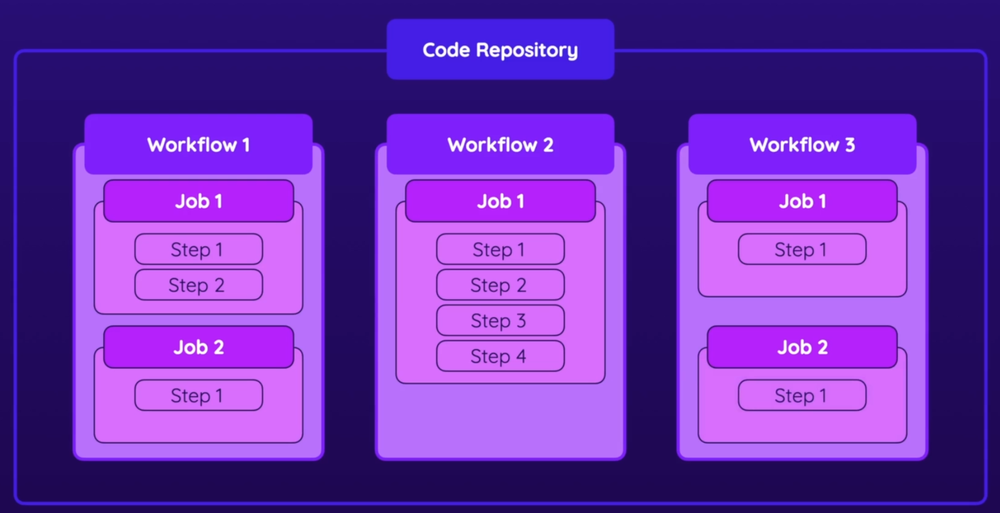
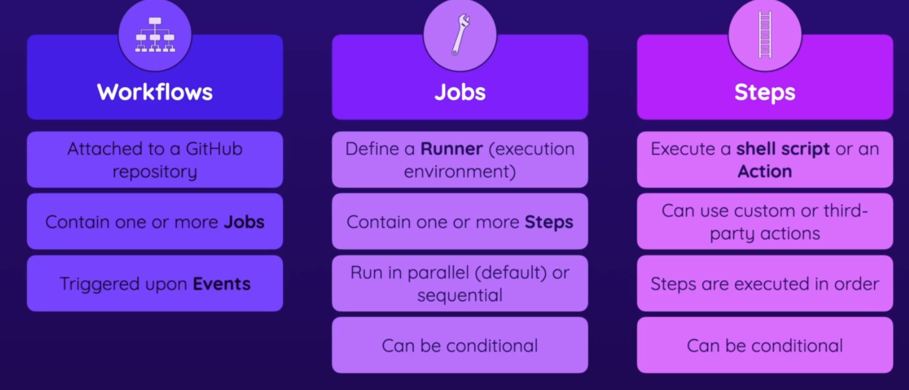
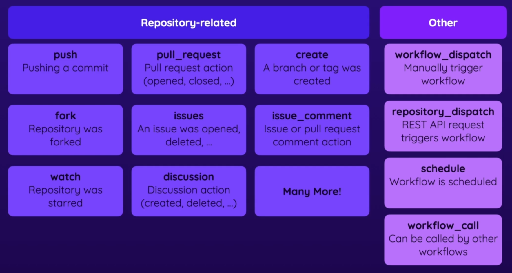
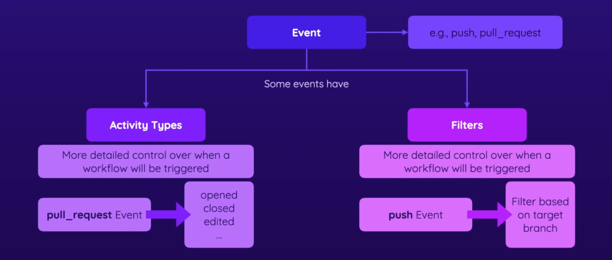
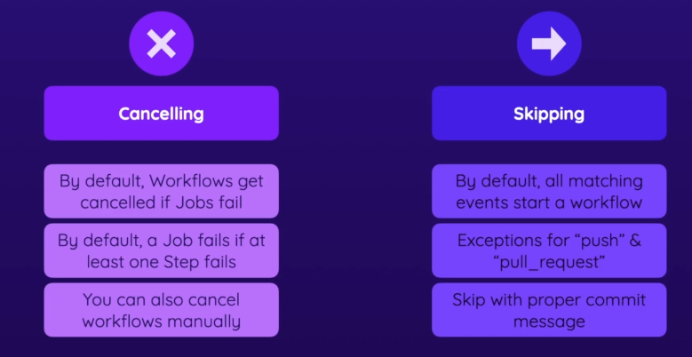
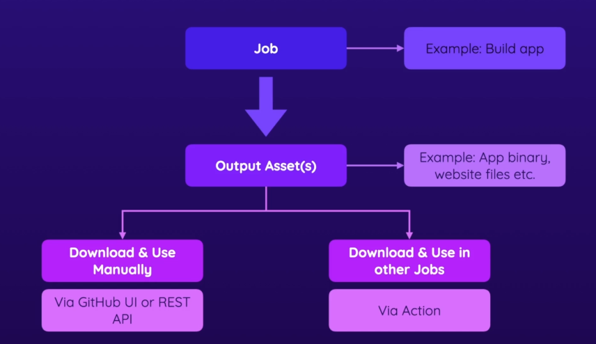
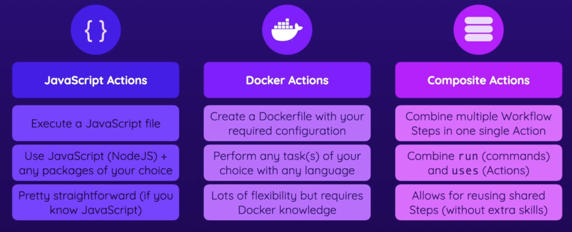

# Github Actions

## Basic building blocks
Workflows are what you add to your repository. Those workflows contain one or more jobs.
Those jobs contain one or more steps that will be executed in the order that they are
specified.





In public repositories, you can use GitHub Actions for free. For private 
repositories, only a certain amount of monthly usage is available for free - extra usage 
on top must be paid.

To have multiline shell  commands, then you can precede the commands with a pipe on the
first line.
```yml
run: |
    echo "First output"
    echo "Second output"
```

Github Actions can have a ton of triggers.


An action in the context of Github Actions is a custom application that performs a (typically
complex) frequently repeated task. An alternative to that is using the run key that execute
(typically simple) shell commands that are defined by you.

When you view actions in the marketplace, then a checkmark with "Verified creator" can give
you extra confidence that the action isn't doing anything malicious as it has been verified.

Events can have filters and activity types


Pull requests from forked repositories do not automatically run CI actions on first commit.
This is to avoid spam from untrusted contributors.

Workflows can be cancelled and skipped. You can add a certain string to a commit message
to skip execution. E.g. `[skip ci]`


Jobs can spit out artifacts, and they can be used either manually or automatically.


`continue-on-error: true` can be used to have an action finish with a success, even if a failure
happens.

Multiple steps can be grouped into a single custom action.

You can create a separate repository for custom actions or put them in an existing repository.
